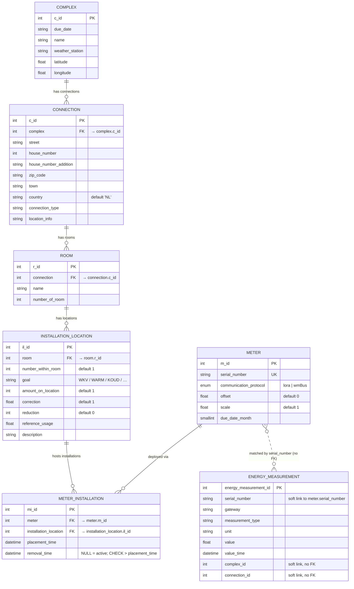

# Database Structure

The Postgres warehouse stores building hierarchy (complex → connection → room → installation location), the meters deployed at those locations, and the energy measurements they produce.

The diagram below mirrors [`src/meterapi/models/db.py`](../src/meterapi/models/db.py). All foreign keys use `ON DELETE RESTRICT`.

## Entity-Relationship Diagram



## Notes

- **Hierarchy.** A `Complex` (building) groups one or more `Connection` rows (postal addresses). Each connection contains `Room`s; each room exposes one or more `InstallationLocation`s — the physical slots where a meter can sit. A meter is tied to a slot through `MeterInstallation`, which is time-bounded (`placement_time` / `removal_time`), so the history of which meter sat where is preserved.
- **Active installation.** `MeterInstallation.removal_time IS NULL` means the meter is currently deployed. The partial index `idx_meter_installation_active` (Postgres only) accelerates that lookup. A `CHECK` constraint enforces `removal_time > placement_time` when removal time is set.
- **`EnergyMeasurement` has no FKs.** `serial_number` is the only link back to `Meter`, and it's a string match — no constraint, no relationship, no cascade. `complex_id` and `connection_id` are loose ints with no constraint either. This is intentional for ingest throughput; lookups are accelerated by `idx_em_serial_time`, `idx_em_time`, and `idx_em_type_time`. Tightening this up is tracked separately.
- **Python attribute ↔ on-disk column.** SQLModel attributes use the `*_id` suffix (`complex_id`, `connection_id`, `room_id`, `meter_id`, `installation_location_id`) while the Postgres columns keep the original short names (`complex`, `connection`, `room`, `meter`, `installation_location`). The mapping is pinned via `sa_column_kwargs={"name": "<original>"}` in [db.py](../src/meterapi/models/db.py). This lets us rename in Python without touching the live schema.
- **Enum.** `MeterCommunicationProtocol` lives in [`src/meterapi/enums.py`](../src/meterapi/enums.py); the corresponding Postgres enum type is named `meter_communication_protocol` with values `lora` / `wmBus`.

## Regenerating This Diagram

The Mermaid block above is hand-maintained against `models/db.py`. If you change a table, update the matching entity in the diagram. A scripted dump of the live schema is available with:

```bash
python -c "
from sqlmodel import SQLModel
import meterapi.models.db  # noqa
for t in SQLModel.metadata.sorted_tables:
    print(t.name, [(c.name, str(c.type), c.nullable, c.primary_key) for c in t.columns])
"
```

Use that as a cross-check before editing the diagram.
